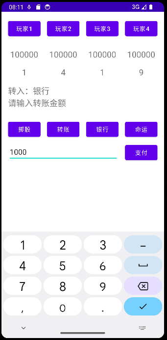
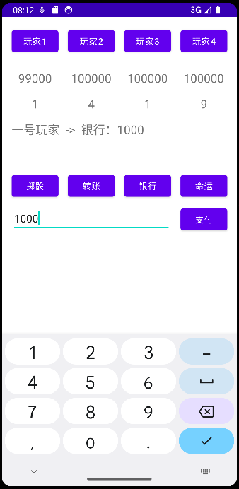

# MonopolyGameToolKit
> Monopoly Game Assistant Tool
> 大富翁游戏辅助工具
> (C) 2023 HuaCL

## Features

1. Roll dice (default range 1-12, can be modified in the code)
2. Act as a bank (initial funds 100,000, can be modified in the code, or funds can be transferred to the bank at the start of the game to change the initial funds)
3. Transfer between accounts, and between accounts and the bank
4. Draw destiny cards (about 40 built-in destiny cards(only chinese), can be modified in the code)

In short, you only need a map, and tokens to complete the Monopoly game, saving the hassle of the bank handling money while adding the fun of destiny cards.

## 功能

1. 掷骰子（默认范围1-12，可以在代码中更改）
2. 充当银行（初始资金100000，可以在代码中更改，也可以在游戏开始时转钱给银行以更改初始资金）
3. 账户之间，账户和银行间转账
4. 抽取命运（内置约40条命运，可以在代码中更改）

总之你只需要地图和标识物就可以完成大富翁游戏，节约了银行繁琐的找钱操作，同时增加了命运的趣味性。

